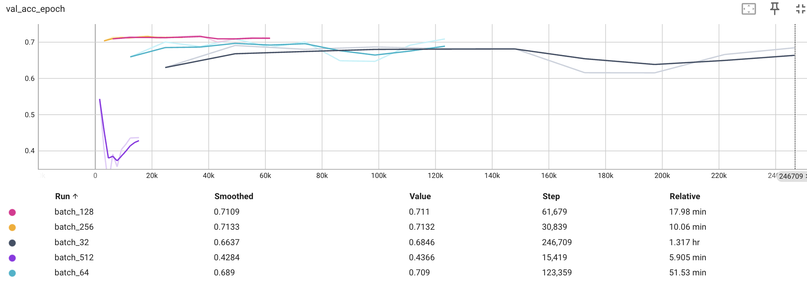
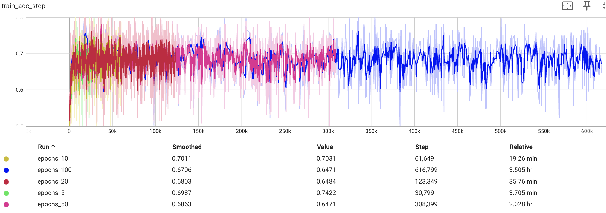
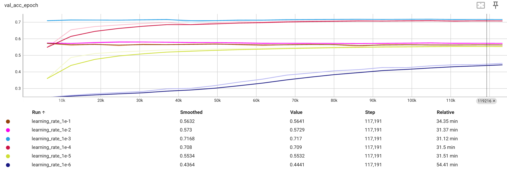

# Question 1
Figure 1 and Figure 2 shows how varying batch sizes have an affect on the training and validation accuracies, respectively.

Larger batch sizes result in better computational efficiency. From Figure 2, it is evident that larger batch sizes require less time to complete all epochs. A batch size of 32 took 1.317 hours to complete while a batch size of 256 required only 10.06 minutes. Additionally, a batch size of 256 took ~30,000 steps to complete 10 epochs while a batch size of 32 took ~8X longer with over 246,000 steps. This is because modern hardware, especially GPUs, are optimized for parallel processing, and larger batches can exploit this parallelism.

Smaller batch sizes can lead to better generalization. Training with smaller batches introduces more noise into the weight updates, which can help the model generalize better to unseen data. Larger batches resulted in a model that memorizes the training data more, leading to overfitting on the training set and potentially poor generalization to new data.

%%%
The figure below shows the results of varying the batch size for the jsc-tiny model over 10 epochs. Batch sizes of 64, 128, 256, and 512.
After 10 epochs, the model with a batch size of 64 has a test accuracy of 49.50%, batch size of 128 has an accuracy of 51.87%, batch size of 256 has an accuracy of 50.48% while a batch size of 512 has an accuracy of 44.64%.
%%%


**Figure 1** - Training accuracy with different batch sizes



**Figure 2** - Validation accuracy with different batch sizes

# Question 2
Figures 3 and 4 show the effect of the varying the maximum number of epochs on training and validation accuracy, respectively.

If the maximum number of epochs is too low, the model might not have sufficient time to learn the underlying patterns in the data, leading to underfitting. The model may not perform well on either the training set or unseen data.

However, if the maximum number of epochs is too high, the model may start memorizing the training data (overfitting), capturing noise in the dataset rather than learning the underlying patterns. This can result in poor generalization to new data.

Additonally, increasing the maximum number of epochs increases the overall training time. This is because the model goes through more iterations of updating its weights with each additional epoch. This is evident in Figure 1 and Figure 2 where 100 epochs took ~3.5 hours and 5 epochs took ~3.5 minutes. 

%%%
To show the impact of this, the jsc-tiny model was used with a batch size of 128 over 5, 10, and 20 epochs. 
After 5 epochs, the accuracy is 50.26%, it is 51.87% after 10 epochs and x% after 20 epochs. 
%%%


**Figure 3** - Training accuracy with different epochs


**Figure 4** - Validation accuracy with different epochs

# Question 3
## Large and Small Learning Rate
### large Learning Rate
- Convergence Speed: A large learning rate can lead to faster convergence during training. The model's weights are updated by larger amounts in each iteration, potentially reaching a good solution more quickly.
- Overshooting: However, a too-large learning rate might cause the model to overshoot the optimal weights, leading to oscillations or divergence. The training process can become unstable, and the model might fail to converge to a good solution.
- Risk of Missing Optima: In some cases, a large learning rate might cause the model to skip over optimal regions in the parameter space, preventing it from finding the best solution.

### Small Learning Rate
- Stability: A small learning rate promotes a more stable training process. Smaller updates to the weights help the model fine-tune its parameters gradually, which can be beneficial for convergence.
- Convergence Speed: However, using a very small learning rate might slow down the convergence process. The model may require more epochs to reach an optimal or near-optimal solution.
- Less Sensitivity to Noise: Smaller learning rates make the training process less sensitive to noisy fluctuations in the training data. This can be advantageous for generalization to unseen data.

Figures 5 and 6 show the effect of the learning rate on training and validation accuracy, respectively. It is evident from Figure 1 that the model with the lowest learning rate (1e-6) has the most mild gradient among all the learning rates. The model ewith the largest learning rate (1e-1) remains in a straight line throughout the training process. This is because it oscillates between local minima, unable to learn the data. 


**Figure 5** - Training accuracy with different learning rates


**Figure 6** - Validation accuracy with different learning rates

## Relationship Between Learning Rate and Batch size
Smaller batch sizes often require a smaller learning rate because the model's parameters are updated more frequently due to the fact that more steps are required to complete each epoch, and large learning rate steps may lead to instability.

Larger batch sizes may tolerate higher learning rates because the updates are less frequent, and more training examples are considered in each iteration.

# Question 4
The network ([JSC_Medium](../machop/chop/models/physical/jet_substructure/__init__.py)), which has about 10X more parameters than the Tiny network (1400 parameters), can be seen below. 

```
class JSC_Medium(nn.Module):
    def __init__(self, info):
        super(JSC_Medium, self).__init__()
        self.seq_blocks = nn.Sequential(
            # 1st LogicNets Layer
            nn.BatchNorm1d(16),  # input_quant      
            nn.ReLU(16),
            nn.Linear(16, 32),  # linear
            nn.BatchNorm1d(32),  # output_quant      
            nn.ReLU(32),
            # 2nd LogicNets Layer
            nn.Linear(32, 16),  
            nn.BatchNorm1d(16),  
            nn.ReLU(16),
            # 3rd LogicNets Layer
            nn.Linear(16, 8),  
            nn.BatchNorm1d(8),  
            nn.ReLU(8),  # 10
            # 4th LogicNets Layer
            nn.Linear(8, 5),
            nn.BatchNorm1d(5),
            nn.ReLU(5),
        )
```

# Question 5
Training the network over 20 epochs with a learning rate of 1e-3 and batch size of 128 is done using the following command;

```
./ch train jsc-medium jsc --max-epochs 20 --batch-size 128 --learning-rate 1e-03
```

After the network has trained, it is tested using the following command;

```
./ch test jsc-medium jsc --load ../mase_output/jsc-medium_classification_jsc_2024-01-24/software/training_ckpts/best.ckpt --load-type pl
```

Figure 7 below shows the results of the testing. It is evident that this network achieved an accuracy of 72.30%. 


**Figure 7** - Test accuracy of custom network

Furthermore, the network is tested againt the Tiny network in order to fully evaluate it.


