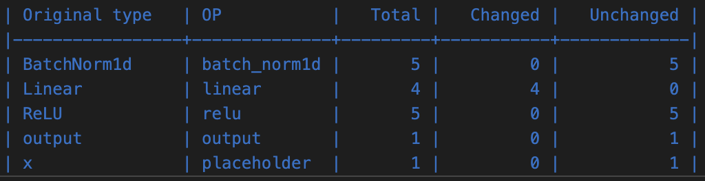
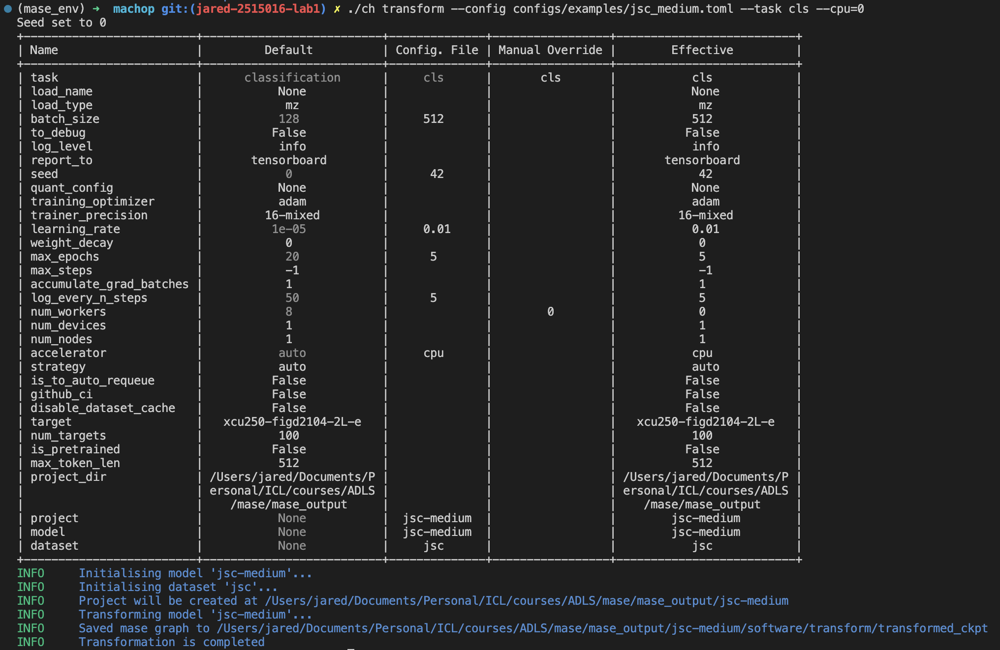

# Question 1

In addition to the other graph analysis passes, namely `add_common_metadata_analysis_pass` and `init_metadata_analysis_pass`, the function `report_graph_analysis_pass` is responsible for generating a summary of the Mase graph analysis. It generates a report for the graph analysis and prints out an overview the model in tabular form. Unlike a transform pass, this function does not alter the graph itself; instead, it outputs to a specified file if provided, or prints the summary to the console otherwise. 

The summary includes a count of various node operation types and module types identified within the graph. The graph is composed of sequence blocks describing Mase operators, such as BatchNorm1d, ReLU, Linear, and ReLU, along with their respective parameters (for the JSC_Tiny network).

`placeholder` in the printed graph correspond to function parameters. In this specific lab scenario, the target 'x' is used as a placeholder, representing a function input.

The operation `get_attr` is employed to retrieve specific attributes or parameters from a module, enhancing the analysis of the computational graph.

The term `call_function` is associated with the utilization of standalone, user-defined, or built-in functions within the computation graph. This function operates independently of any object or module, taking inputs and producing an output.

`call_module` encompasses both data (parameters, states) and methods (like the forward method). When this function is invoked, it essentially calls the forward method of the specified module with the given arguments.

Lastly, `call_method` signifies a method call on an object, specifically bound to the tensor object in this context.

# Question 2
The pass `profile_statistics_analysis_pass` execute profile statistics analysis on the provided graph. This involves gathering statistics related to parameters and activations and storing them in the metadata of the respective nodes. Statistics involves the following functions:

#### Record
  - **Description:** Records all input samples.
  - **Arguments:**
    - `device (str|None)`: Specifies the device to move the samples. If None, no device movement occurs.
    - `add_new_dim_before_concat (bool)`: When True, adds a new dimension before concatenating the samples.

#### VarianceOnline
  - **Description:** Utilizes Welford's online algorithm to compute running variance and mean. It conserves memory by not storing all samples, but precision diminishes with smaller counts.
  - **Arguments:**
    - `device (str|None)`: Designates the device for sample movement. If None, no movement takes place.
    - `dims (str|list|None)`: Determines the dimensions to reduce. If "all," reduces all dimensions. If None, no dimension reduction occurs. If a list, reduces the specified dimensions.

#### VariancePrecise
  - **Description:** Concatenates samples and uses `torch.var` and `torch.mean` for precise variance and mean calculation. More memory-intensive but provides accurate results.
  - **Arguments:**
    - `device (str|None)`: Specifies the device for sample movement. If None, no device movement occurs.
    - `dims (str|list|None)`: Determines the dimensions to reduce. If "all," reduces all dimensions. If None, no dimension reduction occurs. If a list, reduces the specified dimensions.

#### RangeNSigma
  - **Description:** Computes the range of samples within n sigma based on mean and variance, assuming normal distribution.
  - **Arguments:**
    - `device (str|None)`: Specifies the device for sample movement. If None, no device movement occurs.
    - `dims (str|list|None)`: Determines the dimensions to reduce. If "all," reduces all dimensions. If None, no dimension reduction occurs. If a list, reduces the specified dimensions.
    - `abs (bool)`: When True, takes the absolute value of samples before calculating mean and variance.
    - `var_mode (str)`: "precise" or "online". If "precise," uses `VariancePrecise` for variance. If "online," uses `VarianceOnline`.
    - `num_sigma (int)`: Specifies the number of sigma to calculate the range.

#### RangeMinMax
  - **Description:** Computes the range of samples based on minimum and maximum values.
  - **Arguments:**
    - `device (str|None)`: Specifies the device for sample movement. If None, no device movement occurs.
    - `dims (str|list|None)`: Determines the dimensions to reduce. If "all," reduces all dimensions. If None, no dimension reduction occurs. If a list, reduces the specified dimensions.
    - `abs (bool)`: When True, takes the absolute value of samples before calculating min and max.

#### RangeQuantile
  - **Description:** Computes the range of samples based on specified quantiles.
  - **Arguments:**
    - `device (str|None)`: Specifies the device for sample movement. If None, no device movement occurs.
    - `dims (str|list|None)`: Determines the dimensions to reduce. If "all," reduces all dimensions. If None, no dimension reduction occurs. If a list, reduces the specified dimensions.
    - `abs (bool)`: When True, takes the absolute value of samples before calculating quantiles.
    - `quantile (float)`: Specifies the quantile used for range calculation.

#### AbsMean
  - **Description:** Implements an online algorithm to compute the mean, considering the absolute value (E(|x|)).
  - **Arguments:**
    - `device (str|None)`: Specifies the device for sample movement. If None, no device movement occurs.
    - `dims (str|list|None)`: Determines the dimensions to reduce. If "all," reduces all dimensions. If None, no dimension reduction occurs. If a list, reduces the specified dimensions.

`report_node_meta_param_analysis_pass`: Conducts a meta-parameter analysis on the graph nodes, including those supplied for the `profile_statistics_analysis_pass`, and produces a comprehensive report based on this examination. The "which" parameter allows the selection of one of three options: "Common", "Hardware", and "Software".


# Question 3
The `quantize_transform_pass` function receives arguments (via pass_args), and specifically, it only takes the linear operator as input. Consequently, during the execution of the pass, only the linear operator undergoes modifications. Since the jsc-tiny model contains just a single linear operator, this implies that only one OP is altered.

# Question 4
The code to traverse ```mg``` and ```ori_mg``` can be seen below;

```python
# import utility functions
from chop.passes.graph.utils import get_mase_op, get_node_actual_target

# iterate over original and modified graphs to get the nodes of each respective graph
for ori_n, n in zip(ori_mg.fx_graph.nodes, mg.fx_graph.nodes):
    # check if the original node and the modified node are the same.
    # if they are not, then it means that that node has been quantized
    if type(get_node_actual_target(n)) != type(get_node_actual_target(ori_n)):

        # retrieve the original module from the node
        ori_module = get_node_actual_target(ori_n)
        # retrieve the quantized module from the node
        quant_module = get_node_actual_target(n)

        # output where the difference was found
        print(f"A difference was found with '{ori_n.name}' and operation '{get_mase_op(ori_n)}'")

        # output the original type and quantized type to show the quantized type has changed
        print("Original Type:  ", type(ori_module))
        print("Quantized Type:  ", type(quant_module))
        
        # get the precision of the original and quantized weights from the metadata
        ori_n_precision = ori_n.meta["mase"].parameters["common"]["args"]["weight"]["precision"]
        n_precision = n.meta["mase"].parameters["common"]["args"]["weight"]["precision"]
        
        # get the Types of the original and quantized weights from the metadata
        ori_n_type = ori_n.meta["mase"].parameters["common"]["args"]["weight"]["type"]
        n_type = n.meta["mase"].parameters["common"]["args"]["weight"]["type"]
        
        # original weights
        ori_weights = ori_module.weight
        # quantize the weights of the original module
        quantized_weights = quant_module.w_quantizer(ori_module.weight)
```

When outputting the original weights, ```ori_weights```, and the quantized weights, ```quantized_weights```, the differences can be seen below. 

The weights of the first tensor of the original module:
```
[2.8503e-01, -2.4187e-01,  2.9632e-01, -2.3284e-01, -9.7513e-02, -3.4525e-01,  1.5537e-01,  6.0373e-01, -5.3559e-02, -5.6506e-02, 1.7504e-01, 6.7563e-02,  1.4649e-01, -8.2523e-02,  1.6492e-01, -7.7725e-02]
```

The weights of the first tensor of the quantized module:
```
[-0.1875,  0.0625, -0.8750, -0.3125, -0.1875, -0.4375, -0.0000, -0.0000, 0.1250,  0.5000,  0.0625, -0.1250, -0.1250, -0.0625, 0.1250, -0.0000]
```

It is evident that the weights have been successfuly quantized.

# Question 5
The flow to quantize my custom network can be seen below.

```python
from chop.ir.graph.mase_graph import MaseGraph
from chop.tools.checkpoint_load import load_model
from chop.models import get_model_info, get_model
from chop.passes.graph.transforms import (
    quantize_transform_pass,
    summarize_quantization_analysis_pass,
)
from chop.passes.graph import (
    add_common_metadata_analysis_pass,
    init_metadata_analysis_pass,
)

# load in dataset
batch_size = 8
model_name = "jsc-medium"
dataset_name = "jsc"

data_module = MaseDataModule(
    name=dataset_name,
    batch_size=batch_size,
    model_name=model_name,
    num_workers=0,
)
data_module.prepare_data()
data_module.setup()

# load model from checkpoint
CHECKPOINT_PATH = "/Users/jared/Documents/Personal/ICL/courses/ADLS/mase/mase_output/jsc-medium_classification_jsc_2024-01-24/software/training_ckpts/best-v3.ckpt"
model_info = get_model_info(model_name)
model = get_model(
    model_name,
    task="cls",
    dataset_info=data_module.dataset_info,
    pretrained=False)

model = load_model(load_name=CHECKPOINT_PATH, load_type="pl", model=model)

# configuration of the transform pass
pass_args = {
    "by": "type",
    "default": {"config": {"name": None}},
    "linear": {
        "config": {
            "name": "integer",
            # data
            "data_in_width": 8,
            "data_in_frac_width": 4,
            # weight
            "weight_width": 8,
            "weight_frac_width": 4,
            # bias
            "bias_width": 8,
            "bias_frac_width": 4,
        }
    },
}

# get the input generator
input_generator = InputGenerator(
    data_module=data_module,
    model_info=model_info,
    task="cls",
    which_dataloader="train",
)

# create dummy input data
dummy_in = next(iter(input_generator))

# generate the mase graph and initialize node metadata
ori_mg = MaseGraph(model=model)
ori_mg, _ = init_metadata_analysis_pass(ori_mg, None)
ori_mg, _ = add_common_metadata_analysis_pass(ori_mg, {"dummy_in": dummy_in})

mg, _ = quantize_transform_pass(mg, pass_args)
summarize_quantization_analysis_pass(ori_mg, mg, save_dir="quantize_summary")
```

The pass arguments, ```pass_args``` remain the same as only a ```Linear``` was used in my custom network as seen in the [JSC_Medium](../machop/chop/models/physical/jet_substructure/__init__.py) definition. 

The output of ```summarize_quantization_analysis_pass``` gives the following results;


**Figure 1** - Output of *summarize_quantization_analysis_pass*

From Figure 1, it is evident that the four linear layers of the model have changed.

# Question 6
As with Question 4, the original and quantized graphs are travered as follows;

```python
from chop.ir.graph.mase_graph import MaseGraph
from chop.passes.graph.utils import get_mase_op, get_mase_type, get_node_actual_target

# iterate over original and modified graphs
for ori_n, n in zip(ori_mg.fx_graph.nodes, mg.fx_graph.nodes):
    # check if the original node and the modified node are the same
    # if they are not, then it means that that node has been quantized
    if type(get_node_actual_target(n)) != type(get_node_actual_target(ori_n)):
        # retrieve the original module from the node
        ori_module = get_node_actual_target(ori_n)
        # retrieve the quantized module from the node
        quant_module = get_node_actual_target(n)

        # output where the difference was found
        print(f"A difference was found with '{ori_n.name}' and operation '{get_mase_op(ori_n)}'")

        # output the original type and quantized type to show the quantized type has changed
        print("Original Type:  ", type(ori_module))
        print("Quantized Type:  ", type(quant_module))
        
        # get the precision of the original and quantized weights from the metadata
        ori_n_precision = ori_n.meta["mase"].parameters["common"]["args"]["weight"]["precision"]
        n_precision = n.meta["mase"].parameters["common"]["args"]["weight"]["precision"]
        
        # get the Types of the original and quantized weights from the metadata
        ori_n_type = ori_n.meta["mase"].parameters["common"]["args"]["weight"]["type"]
        n_type = n.meta["mase"].parameters["common"]["args"]["weight"]["type"]
        
        # original weights
        ori_weights = ori_module.weight
        # quantize the weights of the module
        quantized_weights = quant_module.w_quantizer(ori_module.weight)
```

The output of the above code shows that the precision has changed from `[32]` in the original module to `[8, 4]` in the quantized module.

Additoanlly, when outputting the original weights, ```ori_weights```, and the quantized weights, ```quantized_weights```, the differences can be seen below. 

The weights of the first tensor of the original module:
```
[-9.3865e-03, -4.4277e-02, -8.8426e-02,  1.8823e-01, -9.4592e-02, 3.5020e-02,  2.1780e-01, -2.4669e-03,  4.5797e-01,  2.8514e-02, 2.0174e-01,  2.3578e-01, -5.1667e-02, -1.0595e-01,  6.3118e-01, -4.6962e-02,  4.3133e-01,  6.3068e-02,  2.6001e-01,  3.0305e-01, -3.3856e-02, -9.7126e-02,  3.2829e-01,  1.1802e-01, -2.5944e-01, -8.8591e-02,  1.1392e-01, -1.6266e-01, -6.2965e-02, -9.8105e-02, 1.8416e-01,  4.7282e-02]
```

The weights of the first tensor of the quantized module:
```
[-0.0000, -0.0625, -0.0625,  0.1875, -0.1250,  0.0625,  0.1875, -0.0000, 0.4375,  0.0000,  0.1875,  0.2500, -0.0625, -0.1250,  0.6250, -0.0625, 0.4375,  0.0625,  0.2500,  0.3125, -0.0625, -0.1250,  0.3125,  0.1250, -0.2500, -0.0625,  0.1250, -0.1875, -0.0625, -0.1250,  0.1875,  0.0625]
```

It is evident that the weights have been successfuly quantized.

# Question 7
My pre-trained network is loaded in using the toml file defined in [jsc_medium.toml](../machop/configs/examples/jsc_medium.toml) with the following command;

`./ch transform --config configs/examples/jsc_medium.toml --task cls --cpu=0`.

Figure 2 below shows the output of this command. It is evident that the model has been transformed.


**Figure 2** - Quantization from command line
