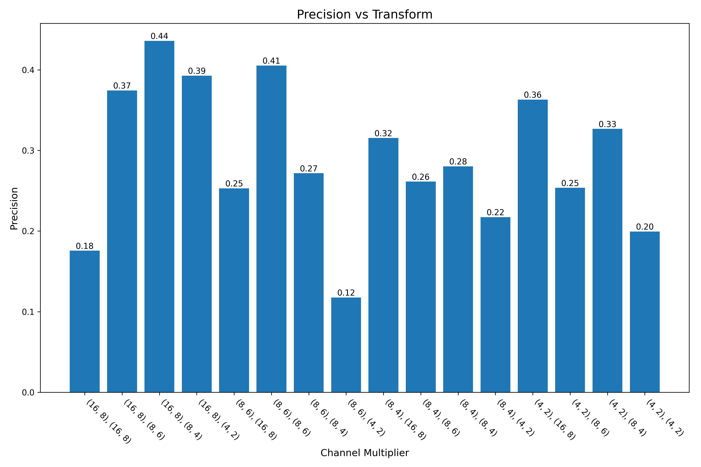
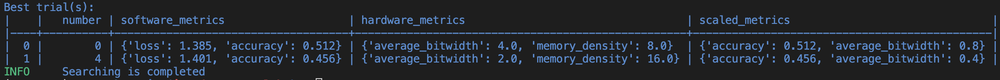

# Quesion 1
The following quality metrics can be used for the search process:
- Latency: Latency is the time taken by the model to make predictions on a single input. It measures the inference time and is crucial for applications with real-time constraints.
- Model Size: Model size refers to the number of parameters in the neural network. It provides insights into the complexity and memory requirements of the model.
- Number of FLOPs (Floating-Point Operations): FLOPs represent the number of floating-point operations performed by the model during inference. It indicates the computational complexity of the model.
- Precision, Recall, F1 Score: Precision, recall, and F1 score are metrics commonly used in binary or multiclass classification to evaluate the performance of a model on specific classes. They provide insights into the model's ability to correctly identify positive instances (precision), capture all positive instances (recall), and balance between precision and recall (F1 score).
- Resource Utilization (CPU, GPU, Memory): Measure the utilization of computational resources during model inference. This includes CPU usage, GPU usage, and memory usage.
- Energy Consumption: Estimate the energy consumption of the model during inference. This is important for resource-constrained environments and mobile applications.

# Question 2
Accuracy and loss serve as the same quality metric because the task at hand is a classification task, where the primary goal is to correctly classify input samples. Accuracy is a common metric used to measure the model's ability to correctly classify samples, while loss is often used as the optimization objective in training. In classification tasks, optimizing for accuracy and minimizing cross-entropy loss generally align with each other.

In addition to the exisiting accuracy and loss metrics, precision, recall, f1-score, latency, model size and gpu power usage are implemented as seen below.

```python
# calculate model size (number of parameters)
model_size = sum(p.numel() for p in mg.model.parameters())

metric = MulticlassAccuracy(num_classes=5)
precision = Precision(num_classes=5, average='weighted', task='multiclass')
recall = Recall(num_classes=5, average='weighted', task='multiclass')
f1_score = F1Score(num_classes=5, average='weighted', task='multiclass')

num_batchs = 5
# This first loop is basically our search strategy,
# in this case, it is a simple brute force search

recorded_accs, recorded_loss, recorded_prec, recorded_rec, recorded_f1, recorded_lats, recorded_gpu_pow = [], [], [], [], [], [], []
    
# get current GPU power usage
def fetch_gpu_power():
    try:
        # Use subprocess to execute the nvidia-smi command and retrieve power draw information
        power_info = subprocess.check_output(['nvidia-smi', '--query-gpu=power.draw', '--format=csv,noheader,nounits']).decode().strip()

        # Extract power draw values and convert them to a list of floats
        power_draw_values = []
        for value in power_info.split('\n'):
            power_draw_values.append(float(value))

        return True, power_draw_values

    # Handle exceptions, for example, when nvidia-smi is not found
    except Exception as error:
        return False, []

# check for GPU
_, has_gpu = fetch_gpu_power()

for i, config in enumerate(search_spaces):
    mg, _ = quantize_transform_pass(mg, config)
    j = 0

    # this is the inner loop, where we also call it as a runner.
    acc_avg, loss_avg, prec_avg, rec_avg, f1_avg, lat_avg, gpu_avg = 0, 0, 0, 0, 0, 0, 0
    accs, losses, precs, recs, f1s, latencies, gpu_pow = [], [], [], [], [], [], []

    for inputs in data_module.train_dataloader():
        # measure GPU power before prediction
        if has_gpu:
            _, gpu_before_pred = sum(fetch_gpu_power()[0])

        xs, ys = inputs
        start = time.time()
        preds = mg.model(xs)
        end = time.time()

        # measure GPU power after prediction
        if has_gpu:
            _, gpu_after_pred = sum(fetch_gpu_power()[0])
            gpu_used = gpu_after_pred - gpu_before_pred
            gpu_pow.append(gpu_used)

        # calculate loss
        loss = torch.nn.functional.cross_entropy(preds, ys)
        # calculate accuracy
        acc = metric(preds, ys)
        # calculate precision
        prec = precision(preds, ys)
        # caluclate recall
        rec = recall(preds, ys)
        # calculate f1_score
        f1 = f1_score(preds, ys)

        # append to list
        accs.append(acc)
        losses.append(loss)
        precs.append(prec)  
        recs.append(rec)
        f1s.append(f1)

        if j > num_batchs:
            break
        j += 1

        # calculate latency
        latency = end - start
        latencies.append(latency)

    # calculate averages
    acc_avg = sum(accs) / len(accs)
    loss_avg = sum(losses) / len(losses)
    prec_avg = sum(precs) / len(precs)
    rec_avg = sum(recs) / len(recs)
    f1_avg = sum(f1s) / len(f1s)
    lat_avg = sum(latencies) / len(latencies)

    # append averges to list
    recorded_accs.append(acc_avg.item())
    recorded_loss.append(loss_avg.item())
    recorded_prec.append(prec_avg.item())
    recorded_rec.append(rec_avg.item())
    recorded_f1.append(f1_avg.item())
    recorded_lats.append(lat_avg)

    # add in gpu power if gpu is being used
    if has_gpu:
        gpu_avg = sum(gpu_pow) / len(gpu_pow)
        recorded_gpu_pow.append(gpu_avg)
```


The results are plotted and the following is observed;


**Figure 1** - Accuracy results vs quantize value


**Figure 2** - Loss results vs quantize value


**Figure 3** - Precision results vs quantize value


**Figure 4** - Recall results vs quantize value


**Figure 5** - F1-Score results vs quantize value


**Figure 6** - FLOPs results vs quantize value


**Figure 7** - Model Size results vs quantize value


**Figure 8** - Latency vs quantize value

From Figure 1 and Figure 2, it is evident that the best accuracy and smallest loss is observed for the following configuration:

```python
{
"by": "type",
"default": {"config": {"name": None}},
"linear": {
        "config": {
            "name": "integer",
            # data
            "data_in_width": 8,
            "data_in_frac_width": 4,
            # weight
            "weight_width": 16,
            "weight_frac_width": 8,
            # bias
            "bias_width": 8,
            "bias_frac_width": 4,
        }
},}
```
Furthermore, this configuration also gives the largest precision, recall and F1-Score, as evident from Figures 3-5. 

Also, from Figure 6, it is evident that the number of FLOPs is not affected by the quantization values and remains constant at 1320. Moreover, the size of the model also remains consistent at 117 parameters.

Additionally, the average latency for every configuration can be seen in Figure 8.  

# Question 3
The brute force search can be implemented by following the procedure `optuna.py`. In the `sampler_map` function, an addiotnal case for brutesearch is added;

```python
case "bruteforce":
    sampler = optuna.samplers.BruteForceSampler()
```

To use this new search method, the `sampler` variable in the `[search.strategy.setup]` section of the `jsc_toy_by_type.toml` is changed to `brutesearch`.

# Question 4

Efficiency in sampling is indicative of how effectively a method navigates the search space and discovers optimal solutions within a restricted number of samples or iterations.

To compare the two methods, 40 runs of brute force and TPE-based search are condicted. The computation times for each method are comparable when measured. However, the TPE sampler, unlike the Brute Force Sampler, doesn't exhaustively attempt all combinations. Instead, it strategically samples the hyperparameter space, drawing insights from prior trials. In each iteration, it uses probability to forecast which hyperparameters are likely to produce superior results. Therefore, for example, if 100 trials  were done, the TPE Sampler, would conduct 100 distinct experiments, continually updating its knowledge and honing the hyperparameter space to identify the optimal configurations. Conversely, in the Brute Force approach, the number of trials is restricted by the potential combinations. 

After the completion of all runs, it was found that the brute force approach took 17.28s per trial wehile the TPE samler took 16.88s per trial. 

To see the effect that each method has, the accuracy for each configuration is plotted in Figure 9 below. 


**Figure 9** - TPE vs. Brute Force search

It is evident from Figure 9 that TPE takes less steps to find the best configuration due to how it conducts its search. It makes better choices initially but then gets poorer results the longer the search goes on. 

Brute force tries all configurations one by one and therefore oscillates a lot. 

The outputs of the TPE search and Brute Force search can be seen in Figure 10 and Figure 11, respectively.


**Figure 10** - TPE search results


**Figure 11** - Brute Force search results
