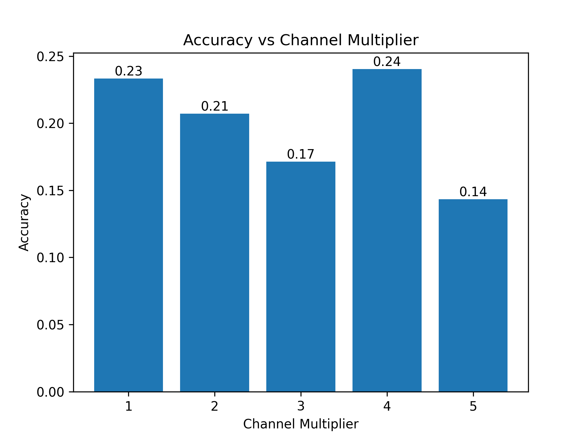
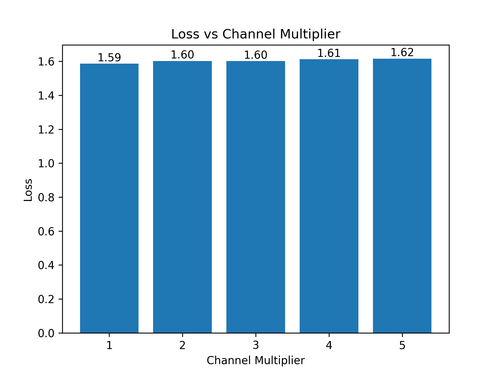
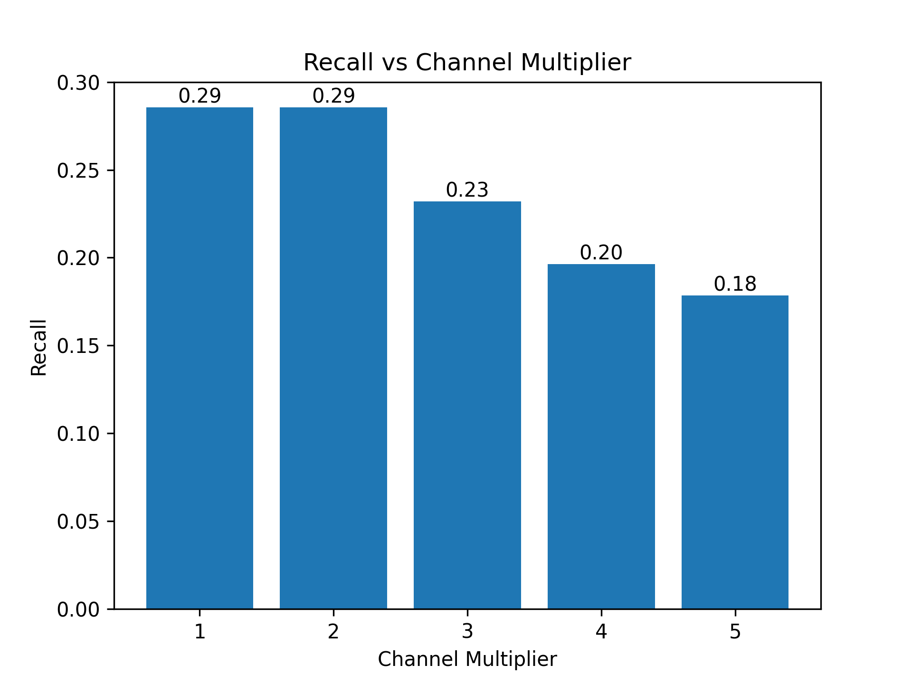
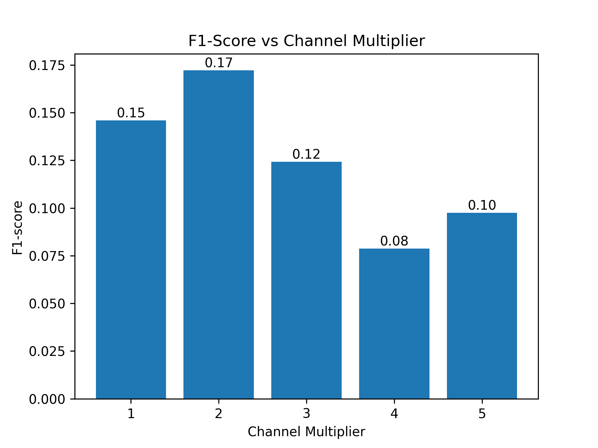

When you stack multiple linear layers without non-linear activation functions in between, the composition of these layers remains a linear transformation. This means that no matter how many layers you add, the overall operation can be represented as a single linear transformation. As a result, the network would lack the capacity to learn complex, non-linear relationships between input and output.

The purpose of activation functions such as ReLU, sigmoid, or tanh is to introduce non-linearities into the network. These non-linearities allow the neural network to learn and model more complex patterns and relationships in the data. Without them, the network would be limited to linear transformations, making it unable to capture the intricacies of many real-world problems.

# Question 1
To be able to modily the new `Three_Linear_Layer` model to have its layers expaned to double their size, the following `pass_config` is used;

```python
pass_config = {
"by": "name",
"default": {"config": {"name": None}},
"seq_blocks_2": {
    "config": {
        "name": "output_only",
        # weight
        "channel_multiplier": 2,
        }
    },
"seq_blocks_4": {
    "config": {
        "name": "both",
        "channel_multiplier": 2,
        }
    },
"seq_blocks_6": {
    "config": {
        "name": "input_only",
        "channel_multiplier": 2,
        }
    },
}
```

Due to the linear layers appearing in the 2nd, 4th and 6th layers in the network, only those sequence blocks (`seq_blocks_2`, `seq_blocks_4`, `seq_blocks_6`) are targeted. 

The new `pass_config` is then used in the `redefine_linear_transform_pass` function and `report_graph_analysis_pass` is used to putput the results as follows.

```python
mg, _ = redefine_linear_transform_pass(
    graph=mg, pass_args={"config": pass_config})

_ = report_graph_analysis_pass(mg)
```

The result of this is the following;
```json
[BatchNorm1d(16, eps=1e-05, momentum=0.1, affine=True, track_running_stats=True), ReLU(inplace=True), Linear(in_features=16, out_features=32, bias=True), ReLU(inplace=True), Linear(in_features=32, out_features=32, bias=True), ReLU(inplace=True), Linear(in_features=32, out_features=5, bias=True), ReLU(inplace=True)]
```

It is evident that the layers have been expanded to double their size.

# Question 2
To search for the best channel multiplier value, a grid search is used as follows;

```python
import torch
import subprocess
from torchmetrics.classification import MulticlassAccuracy
from torchmetrics import Precision, Recall, F1Score

# create a search space from channel multipliers
channel_multipliers = [1, 2, 3, 4, 5]
search_spaces = []
for cm in channel_multipliers:
    pass_config['seq_blocks_2']['config']['channel_multiplier'] = cm
    pass_config['seq_blocks_4']['config']['channel_multiplier'] = cm
    pass_config['seq_blocks_6']['config']['channel_multiplier'] = cm
    search_spaces.append(copy.deepcopy(pass_config))

# instantiate metrics
metric = MulticlassAccuracy(num_classes=5)
precision = Precision(num_classes=5, average='weighted', task='multiclass')
recall = Recall(num_classes=5, average='weighted', task='multiclass')
f1_score = F1Score(num_classes=5, average='weighted', task='multiclass')

num_batchs = 5
recorded_accs, recorded_loss, recorded_prec, recorded_rec, recorded_f1, recorded_lats, recorded_gpu_pow, recorded_model_sizes, recorded_flops = [], [], [], [], [], [], [], [], []
    
# get current GPU power usage
def fetch_gpu_power():
    try:
        # Use subprocess to execute the nvidia-smi command and retrieve power draw information
        power_info = subprocess.check_output(['nvidia-smi', '--query-gpu=power.draw', '--format=csv,noheader,nounits']).decode().strip()

        # Extract power draw values and convert them to a list of floats
        power_draw_values = []
        for value in power_info.split('\n'):
            power_draw_values.append(float(value))

        return True, power_draw_values

    except Exception as error:
        return False, []

# check for GPU
_, has_gpu = fetch_gpu_power()

# start grid search
for i, config in enumerate(search_spaces):
    # generate the mase graph and initialize node metadata
    mg = MaseGraph(model=model)
    mg, _ = init_metadata_analysis_pass(mg, None)
    mg, _ = add_common_metadata_analysis_pass(mg, {"dummy_in": dummy_in})
    mg, _ = add_software_metadata_analysis_pass(mg, None)

    # run the transform pass
    new_mg, _ = redefine_linear_transform_pass(
    graph=mg, pass_args={"config": config})

    # use flps pass to count flops
    _, result = count_flops_mg_analysis_pass(new_mg, {})
    flops = result['flops']
    recorded_flops.append(flops)

    j = 0

    # keep track of metric results
    acc_avg, loss_avg, prec_avg, rec_avg, f1_avg, lat_avg, gpu_avg = 0, 0, 0, 0, 0, 0, 0
    accs, losses, precs, recs, f1s, latencies, gpu_pow = [], [], [], [], [], [], []

    # calculate model size (number of parameters)
    model_size = sum(p.numel() for p in new_mg.model.parameters())
    recorded_model_sizes.append(model_size)

    # this is the inner loop, where we also call it as a runner.
    for inputs in data_module.train_dataloader():
        # measure GPU power before prediction
        if has_gpu:
            _, gpu_before_pred = sum(fetch_gpu_power()[0])

        xs, ys = inputs
        start = time.time()
        # make prediction
        preds = new_mg.model(xs)
        end = time.time()

        # measure GPU power after prediction
        if has_gpu:
            _, gpu_after_pred = sum(fetch_gpu_power()[0])
            gpu_used = gpu_after_pred - gpu_before_pred
            gpu_pow.append(gpu_used)

        # calculate loss
        loss = torch.nn.functional.cross_entropy(preds, ys)
        # calculate accuracy
        acc = metric(preds, ys)
        # calculate precision
        prec = precision(preds, ys)
        # caluclate recall
        rec = recall(preds, ys)
        # calculate f1_score
        f1 = f1_score(preds, ys)

        # append to list
        accs.append(acc)
        losses.append(loss)
        precs.append(prec)  
        recs.append(rec)
        f1s.append(f1)

        if j > num_batchs:
            break
        j += 1

        # calculate latency
        latency = end - start
        latencies.append(latency)

    # calculate averages
    acc_avg = sum(accs) / len(accs)
    loss_avg = sum(losses) / len(losses)
    prec_avg = sum(precs) / len(precs)
    rec_avg = sum(recs) / len(recs)
    f1_avg = sum(f1s) / len(f1s)
    lat_avg = sum(latencies) / len(latencies)

    # append averges to list
    recorded_accs.append(acc_avg.item())
    recorded_loss.append(loss_avg.item())
    recorded_prec.append(prec_avg.item())
    recorded_rec.append(rec_avg.item())
    recorded_f1.append(f1_avg.item())
    recorded_lats.append(lat_avg)

    # add in gpu power if gpu is being used
    if has_gpu:
        gpu_avg = sum(gpu_pow) / len(gpu_pow)
        recorded_gpu_pow.append(gpu_avg)
```

The results are plotted and the following is observed;


**Figure 1** - Accuracy results vs multiplier value


**Figure 2** - Loss results vs multiplier value


**Figure 3** - Precision results vs multiplier value


**Figure 4** - Recall results vs multiplier value


**Figure 5** - F1-Score results vs multiplier value


**Figure 6** - FLOPs results vs multiplier value


**Figure 7** - Model Size results vs multiplier value


**Figure 8** - Average Latency vs multiplier value

From Figure 1, the greatest accuracy is achieved with a multiplier of 1. Interestingly, the best F1-score is achieved for a multiplier value of 2, indicating bias in the model. 

Figure 6 shows that the number of FLOPs in the architecture increases with increasing multipliers. This is because, as can be seen in Figure 7, the size of the model increases with increasing multiplier size. Additionally, Figure 8 shows that the model with a multiplier value of 1 has the highest latency with 2.55ms. 

# Question 3
To ensure that the layers do not scale uniformly, the a parent lkey must be used in order to get the channel multiplier value of the previous Linear Layer. This is to ensure that the output of the parent linear layer is equal to the input of the child linear layer. The follwoing fucntion is used; 

```python
def redefine_linear_transform(graph, pass_args_=None):
    pass_args = deepcopy(pass_args_)
    main_config = pass_args.pop('config')
    default = main_config.pop('default', None)
    new_module = None

    if default is None:
        raise ValueError("default configuration must be provided.")
    
    for _, node in enumerate(graph.fx_graph.nodes, start=1):
        config = main_config.get(node.name, default)['config']
        name = config.get("name", None)
        
        if name is not None:
            ori_module = graph.modules[node.target]
            in_features = ori_module.in_features
            out_features = ori_module.out_features
            bias = ori_module.bias
            
            if name == "output_only":
                out_features = out_features * config["channel_multiplier"]
            elif name == "both":
                in_features = in_features * main_config.get(config['parent'], default)['config']["channel_multiplier"]
                out_features = out_features * config["channel_multiplier"]
            elif name == "input_only":
                in_features = in_features * main_config.get(config['parent'], default)['config']["channel_multiplier"]
            new_module = instantiate_linear(in_features, out_features, bias)
        
        if new_module is not None:
            parent_name, name = get_parent_name(node.target)
            setattr(graph.modules[parent_name], name, new_module)
    return graph, {}
```

The pass_args to pass into the function;

```python
pass_args = {
    "by": "name",
    "default": {
        "config": {
            "name": None
            }
    },
    "seq_blocks_2": {
        "config": {
            "name": "output_only", 
            "channel_multiplier": 2
            }
    },
    "seq_blocks_4": {
        "config": {
            "name": "both", 
            "channel_multiplier": 4,
            "parent": "seq_blocks_2"
            }
    },
    "seq_blocks_6": {
        "config": {
            "name": "input_only", 
            "channel_multiplier": 4,
            "parent": "seq_blocks_4"
            }
    },
}
```

Using the `redefine_linear_transform` function;

```python
# create model
model = JSC_Three_Linear_Layers()

# generate the mase graph and initialize metadata
mg = MaseGraph(model=model)
mg, _ = init_metadata_analysis_pass(mg, None)

# perform transformation on the model
mg, _ = redefine_linear_transform(mg, pass_args)
_ = report_graph_analysis_pass(mg)
```

The following putput is observed;

**Figure 9** - Output of redefined function to allow for non-linear scaled layers

From Figure 9, it is evident that the layers are been scaled non-uniformly. 


# Question 4
First, a folder called `channel_modifier` is created under the `search_space` directory. In this folder, a [graph.py](../machop/chop/actions/search/search_space/channel_modifier/graph.py) file is created which contains a `ChannelMultiplier` class, which in turn inherits from the `SearchSpaceBase` base class ([base.py](../machop/chop/actions/search/search_space/base.py) class).

For the actual implementation of the pass, a [modifier.py](../machop/chop/passes/graph/transforms/channel_modifier/modifier.py) file is created under the `channel_modifier` folder which is situated under passes > graph > transforms. This file is responsible for traversing the nodes of a given graph and multiplying the correct layers as follows;

```python
for node in graph.fx_graph.nodes:
        i += 1
        # if node name is not matched, it won't be tracked
        config = main_config.get(node.name, default)['config']
        name = config.get("name", None)
        
        actual_target = get_node_actual_target(node)
        if isinstance(actual_target, nn.Linear):
            if name is not None:
                if node.target=='x' or node.target=='output':
                    continue
                ori_module = graph.modules[node.target]
                in_features = ori_module.in_features
                out_features = ori_module.out_features
                bias = ori_module.bias
                if name == "output_only":
                    out_features = out_features * config["channel_multiplier"]
                elif name == "both":
                    in_features = in_features * main_config.get(config['parent'], default)['config']["channel_multiplier"]
                    out_features = out_features * config["channel_multiplier"]
                elif name == "input_only":
                    in_features = in_features * main_config.get(config['parent'], default)['config']["channel_multiplier"]
                new_module = instantiate_linear(in_features, out_features, bias)
            
        elif isinstance(actual_target, ReLU):
            name = config.get("name")
            if name:
                ori_module = graph.modules[node.target]
                new_module = instantiate_relu(ori_module.inplace)
                setattr(graph.modules[node.target], "inplace", new_module.inplace)
        
        elif isinstance(actual_target, nn.BatchNorm1d):
            name = config.get("name")
            if name:
                ori_module = graph.modules[node.target]
                # new BatchNorm1d with the original parameters
                new_module = instantiate_batchnorm(
                    ori_module.num_features, ori_module.eps, ori_module.momentum, 
                    ori_module.affine, ori_module.track_running_stats)
                parent_name, child_name = get_parent_name(node.target)
                setattr(graph.modules[parent_name], child_name, new_module)   

        if new_module is not None:
            parent_name, name = get_parent_name(node.target)
            setattr(graph.modules[parent_name], name, new_module)
```

A parent variable is used to link a linear layer to its most recent linear layer parent, in order to ensure that the output of the parent is equal to the input of the child. 

Then, a `toml` file is created to define the configuration with the following information;

```toml
[search.search_space]
name = "graph/quantize/channel_size_modifier"

[search.search_space.seed.default.config]
# the only choice "NA" is used to indicate that layers are not quantized by default
name = ["NA"]
channel_multiplier = [1, 2, 3, 4]

[search.search_space.seed.seq_blocks_2.config]
name = ["output_only"]
channel_multiplier = [1, 2, 3, 4]

[search.search_space.seed.seq_blocks_4.config]
name = ["both"]
channel_multiplier = [1, 2, 3, 4]
parent = ['seq_blocks_2']

[search.search_space.seed.seq_blocks_6.config]
name = ["input_only"]
channel_multiplier = [1, 2, 3, 4]
parent = ['seq_blocks_4']
```

# Optional Task
For this task, I will define a search space for channel dimention for the VGG7 Network.

First, the VGG7 netwrork is trained on the Cifar10 data using the following command;

```python
./ch train vgg7 cifar10 --accelerator gpu
```

Then, to be able to work with the VGG7 network, the `modifier.py` must be amended to allow for `Conv2d` and `BatchNorm2d` layers. This can be seen in the code below;

```python
# BatchNorm2d layers
elif isinstance(actual_target, nn.BatchNorm2d):
            parent = config.get("parent", None)
            if parent is not None:
                ori_module = graph.modules[node.target]
                num_features, eps, momentum, affine = ori_module.num_features, ori_module.eps, ori_module.momentum, ori_module.affine
                num_features = num_features * main_config.get(parent, default)['config']["channel_multiplier"]
                new_module = nn.BatchNorm2d(num_features, eps, momentum, affine)

# Conv2d layers
elif isinstance(actual_target, nn.Conv2d):
    if name is not None:
        ori_module = graph.modules[node.target]
        in_channels = ori_module.in_channels
        out_channels = ori_module.out_channels
        bias = ori_module.bias
        if name == "output_only":
            out_channels = out_channels * config["channel_multiplier"]
        elif name == "both":
            in_channels = in_channels * main_config.get(config['parent'], default)['config']["channel_multiplier"]
            out_channels = out_channels * config["channel_multiplier"]
        elif name == "input_only":
            in_channels = in_channels * main_config.get(config['parent'], default)['config']["channel_multiplier"]
        new_module = nn.Conv2d(in_channels, out_channels,
                                kernel_size=ori_module.kernel_size, stride=ori_module.stride,
                                padding=ori_module.padding, dilation=ori_module.dilation,
                                groups=ori_module.groups, bias=ori_module.bias is not None,
                                padding_mode=ori_module.padding_mode)
```

After that, the `toml` file can be created in a similar way previously, except instead of `seq_blocks` names, there are `feature_layers` names, as follows;

```toml
[search.search_space.seed.feature_layers_0.config]
name = ["output_only"]
channel_multiplier = [1, 2, 4]

[search.search_space.seed.feature_layers_1.config]
parent = ["feature_layers_0"]

[search.search_space.seed.feature_layers_3.config]
name = ["both"]
parent = ["feature_layers_0"]
channel_multiplier = [1, 2, 3, 4]

[search.search_space.seed.feature_layers_4.config]
parent = ["feature_layers_3"]

[search.search_space.seed.feature_layers_7.config]
name = ["both"]
parent = ["feature_layers_3"]
channel_multiplier = [1, 2, 3, 4]

[search.search_space.seed.feature_layers_8.config]
parent = ["feature_layers_7"]

[search.search_space.seed.feature_layers_10.config]
name = ["both"]
parent = ["feature_layers_7"]
channel_multiplier = [1, 2, 3, 4]

[search.search_space.seed.feature_layers_11.config]
name = ["input_only"]
parent = ["feature_layers_10"]

[search.search_space.seed.feature_layers_14.config]
name = ["input_only"]
parent = ["feature_layers_10"]
```

In the configuration file is created, TPE search can be used by setting the search strategy to `optuna` and setting the samler to `tpe` as follows:

```toml
[search.strategy]
name = "optuna"
```

```toml
[search.strategy.setup]
n_jobs = 1
n_trials = 20
timeout = 20000
sampler = "tpe"
sum_scaled_metrics = true 
direction = "maximize"
```


After the search command is run, the following is observed;


**Figure 9** - Output of using TPE search to tune the VGG channel dimension search space

